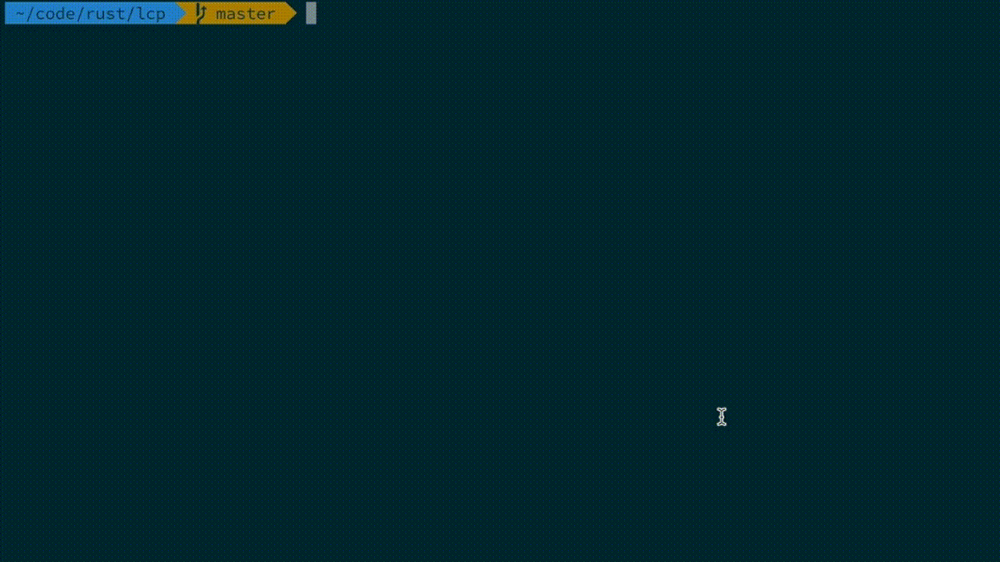
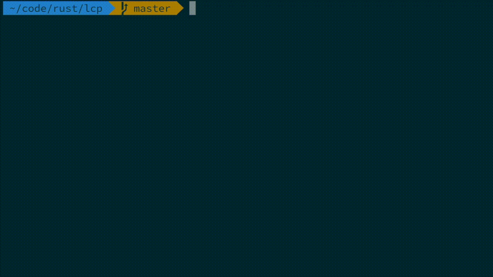

# LessCP

Kind of like [less][1], but then adds the highlighted results to the clipboard.

## Installation

Currently install from source with `cargo`.

```bash
cargo install --path .
```

## Example Usage

### with kubectl



### with git



[1]: https://greenwoodsoftware.com/less/